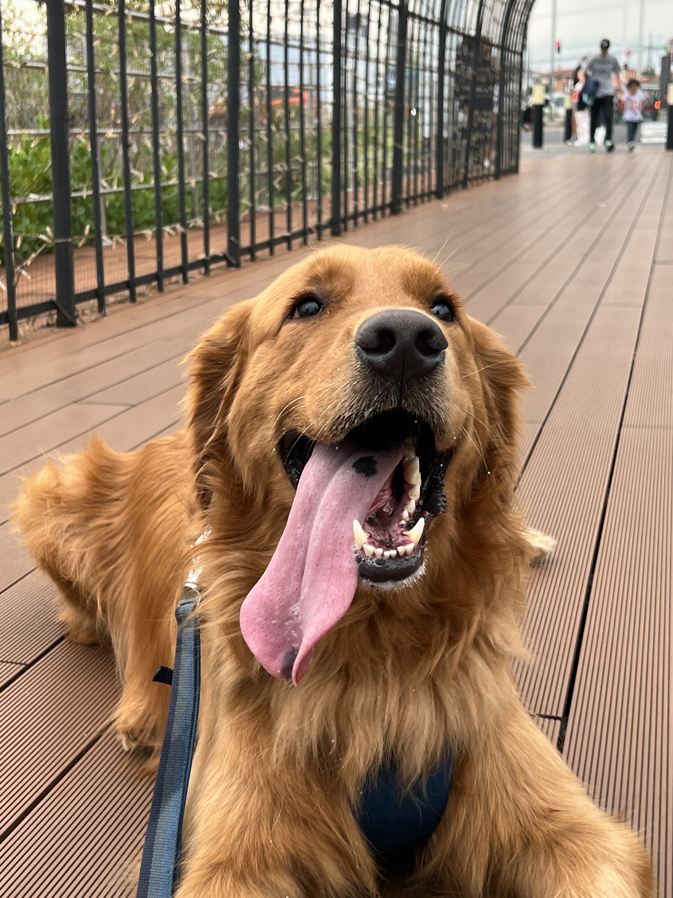
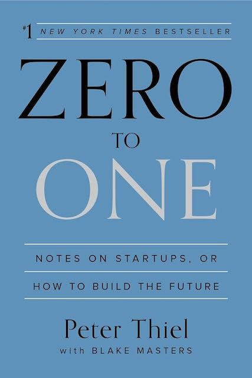

**Hello and welcome to my blog!** I am **Carlos Granados** and I am thrilled to have you here. I love to learn new skills and I like writing about it, that is why I decided to start this blog. I hope you find the content here useful and engaging. If you have any questions or suggestions, please feel free to reach out to me. I would love to hear from you!

## Who am I?

When it comes to my formal education, I am a **Computer Engineer** with a Master's degree in **Project Manager**. If you ask about my work experience, then I have worked as a **Fullstack Engineer**, with a focus on **Search Engine Optimization (SEO)**.

On the other side, I love working out, I have played guitar since I was 13 years old, and I am a huge fan of video games.

I am based in Costa Rica 🇨🇷 and have a dog, a Golden Retriever named Ace. He just turned 3 years old in May 2024.

## Education

I graduated from the **Costa Rica Institute of Technology** with a degree in Computer Engineering. I then pursued a Master's degree in Project Management at the **University of Barcelona**.
Now I spend my time learning new skills using a variety of resources, including online courses, books, and tutorials. I am also a proactive person and I learn more by doing, so I am always working on new projects.

## Work Experience

I have worked as a Fullstack Engineer for the past 5 years. I have experience working with a variety of technologies, including **Typescript, PHP, Golang and SQL**. I have also worked on projects involving Search Engine Optimization (SEO) and have helped companies improve their online presence. I also have experience working with **Docker, Kubernetes, and AWS**.

I love the analytical side of being a Backend Engineer, but I also enjoy the creativity that comes with Frontend development.

I find amazing the kind of websites that can be build in 2024.

## Fun Facts About Me

### What's the latest book you have read?

I am currently reading **"Zero to One: Notes on Startups, or How to Build the Future" by Peter Thiel**. It is a great book that talks about what is needed in order to create the next big company.

[Buy on Amazon.](https://www.amazon.com/Zero-One-Notes-Startups-Future/dp/0804139296)

### What's your favorite videogame?

Elden Ring for sure. But my most played game is Counter Strike.

